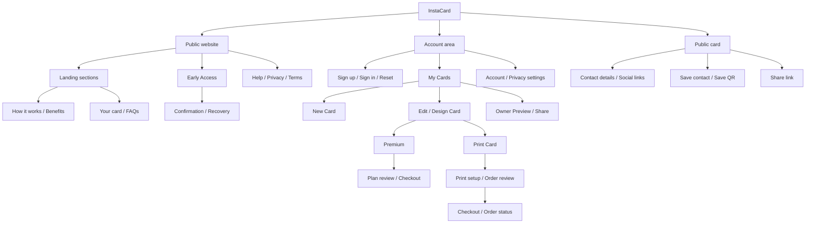
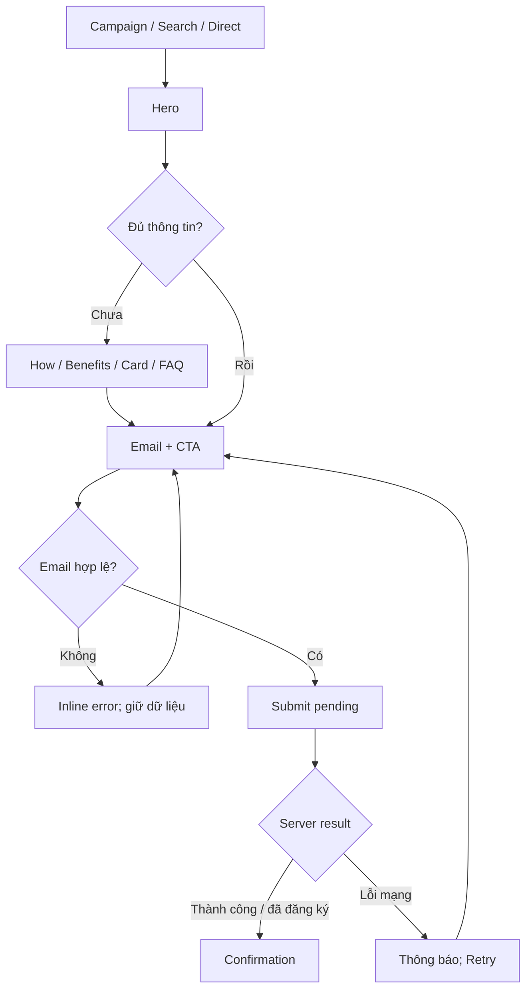
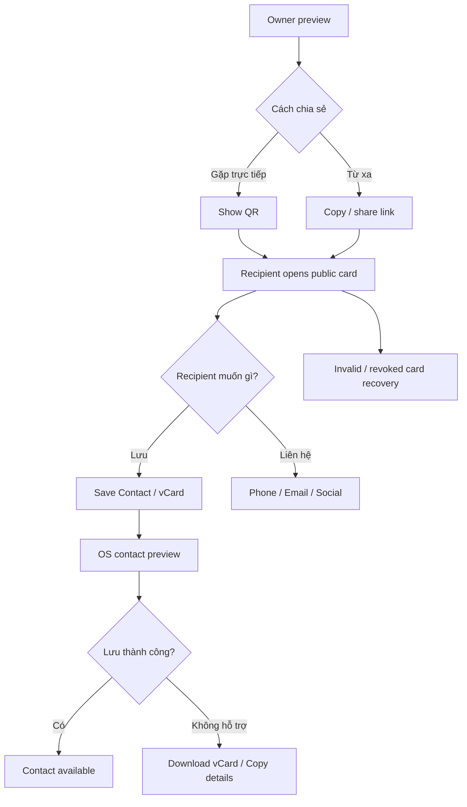

# InstaCard — UX, concept & research

## 1. Bài toán và phạm vi
**Mục tiêu:** giải thích nhanh giá trị của danh thiếp số và tạo ý định đăng ký Early Access. Landing page có một phương án UI với desktop 1440px và mobile 390px. Sitemap/user flow bao quát toàn bộ sản phẩm được đề xuất từ brief và sáu ảnh màn hình; chỉ landing page được thiết kế UI trong đợt này.

**Phân biệt bằng chứng:** brief và assets = VERIFIED input; trang sản phẩm đối thủ = desk-research evidence; pain point/insight của người dùng InstaCard = INFERRED, chưa có phỏng vấn. Không có dữ liệu conversion, số người dùng, test usability hay kết quả kinh doanh.

## 2. Đối tượng và consumer insights
| Nhóm giả thuyết | Bối cảnh / công việc cần hoàn thành | Pain point giả thuyết | Insight giả thuyết | Quyết định thiết kế |
|---|---|---|---|---|
| Freelancer / chuyên gia độc lập | Giới thiệu bản thân tại buổi gặp khách hàng | Phải gửi riêng portfolio, số điện thoại và mạng xã hội | Muốn được hiểu đúng về chuyên môn, không chỉ được lưu số | Một card chứa contact và social, preview ngay hero |
| Sales / client-facing professionals | Trao đổi thông tin khi cuộc gặp sắp kết thúc | Hết card, nhập nhầm, yêu cầu người nhận tải app làm gián đoạn | Thời điểm kết nối quan trọng hơn số tính năng | Thông điệp no-app gần CTA, 3 bước rõ |
| Người nhận card | Lưu đúng người để liên hệ sau | Nhiều bước, đăng ký tài khoản không cần thiết | Chỉ cần lưu contact, chưa cần gia nhập platform | Public card mở bằng browser, Save contact trước |
| Người networking đa ngôn ngữ | Nhận thông tin với tên/ký tự không quen | Khó gõ đúng tên hoặc email | Muốn giữ nguyên danh tính, không cần tự động dịch tên | Multilingual = lưu dữ liệu gốc; không hứa dịch thuật |

JTBD ưu tiên: **Khi gặp một người có thể hợp tác, tôi muốn chia sẻ đủ thông tin trong lúc trò chuyện, để hai bên có thể liên hệ lại mà không mất công nhập lại.** Đây là tổng hợp giả thuyết, không phải trích dẫn phỏng vấn.

## 3. Benchmark / truy cập 22-09-2026

> Detailed competitive research for the three brief-mandated references (Bizz Card, WorldCard Mobile, Linktree), plus direct design implications, is maintained in [`docs/ux-research.md`](./ux-research.md).
| Nguồn | Quan sát có căn cứ | Áp dụng / giới hạn |
|---|---|---|
| [Linktree](https://linktr.ee/) | Gom nhiều nội dung vào một link, cá nhân hóa và chia sẻ bằng URL/QR | Giải thích “One link. All of you.”; không lấy commerce/analytics vào scope |
| [HiHello](https://www.hihello.com/features/digital-business-cards) và [FAQ](https://www.hihello.com/faq) | Card có identity rõ; người nhận xem và lưu bằng browser | Ưu tiên no-app ở hero; không sao chép số khách hàng/testimonial |
| [Blinq](https://blinq.me/solutions/digital-business-card), [recipient flow](https://support.blinq.me/en/articles/68035-sharing-your-blinq-card-in-person) | QR dẫn đến card, người nhận chọn Save Contact | Minh họa kết quả lưu contact; không suy ra InstaCard hỗ trợ NFC/Apple Wallet |
| [WorldCard Mobile](https://apps.apple.com/us/app/worldcard-mobile/id333211045) | Mô tả App Store dùng OCR để chuyển card giấy vào danh bạ; hỗ trợ nhận diện nhiều ngôn ngữ | Tạo khác biệt bằng dữ liệu nhập sẵn, không cần OCR. Không khẳng định competitor có lỗi hiện tại |
| [Bizz Card](https://apps.apple.com/us/app/bizz-card/id732435448) | URL brief không truy cập được qua công cụ; tìm kiếm không xác minh đúng listing | UNKNOWN; không thay bằng sản phẩm trùng tên và không bịa tính năng |
| [21st.dev — Ruixen CardStack](https://21st.dev/@ruixen.ui/components/card-stack) | Pattern card xếp lớp, bản gốc có drag/autoplay | Chỉ chuyển nguyên lý chiều sâu thành bố cục tĩnh. Không copy code/assets, không thêm carousel |

Đánh giá phù hợp: HiHello/Blinq mạnh về recipient task; Linktree mạnh về identity aggregation; WorldCard là đối chiếu cơ chế thu thập contact; 21st là nguồn component composition, không phải bằng chứng conversion.

## 4. Concept / art direction
**Less exchanging. More connecting.** Giảm thao tác trao đổi thông tin để cuộc trò chuyện tiếp tục tự nhiên.

- **Clear:** headline trực diện; một CTA chính; sáu lợi ích có tên và ví dụ nhìn được.
- **Personal:** typography Bricolage Grotesque có cá tính; card Jolly Joe và social links biểu đạt nhiều mặt của một người.
- **Effortless:** layout thoáng, tương phản rõ, form một trường, không chuyển động tự chạy.

Logo SVG gốc được giữ nguyên. Xanh đậm dùng cho hành động, xanh nhạt cho vùng trình bày sản phẩm. Màu xanh lá chỉ xuất hiện ở lợi ích giảm giấy. Bricolage Grotesque + Instrument Sans được lưu local kèm giấy phép OFL. Native UI card trong hero là **marketing concept**, không phải screenshot của app đã phát hành. Screenshot gốc trong phần Your Card giữ nguyên nội dung.

## 5. Câu chuyện landing page
| Thứ tự / anchor | Câu hỏi người xem | Nội dung / mục đích |
|---|---|---|
| Header | Tôi đang xem sản phẩm gì? | Logo, 4 menu anchor, Early Access |
| Hero | Nó có giúp tôi không? | Headline brief, product preview, email + CTA, no-app reassurance |
| How it works | Nó hoạt động thế nào? | Make → Share → Save; giảm mơ hồ về danh thiếp số |
| Why InstaCard | Vì sao đổi từ card giấy? | Đủ Simple, Accurate, Multilingual, Integrated, Green, Customized |
| Your card | Có phù hợp bản thân? | App screenshot và thông tin cá nhân/social |
| FAQs | Còn rào cản nào? | App cho người nhận, chia sẻ, social, customization, Early Access |
| Early access / Footer | Tôi làm gì tiếp? | Lặp form/CTA sau khi đã đánh giá sản phẩm |

Điều chỉnh brief: sửa “Eortless” → “Effortless”; thêm How it works, customization và FAQ; đổi claim 173 cây/ngày thành giảm giấy vì thiếu nguồn. Tính năng sync Google/Microsoft được ghi “planned for launch”, không giả định đã tích hợp. Không đưa giá Premium/in card từ screenshot vào landing vì chưa xác minh điều kiện hiện tại.

## 6. Sitemap toàn sản phẩm — đề xuất
**Đã thiết kế UI:** Landing và các section. **Chỉ đề xuất UX:** toàn bộ đường dẫn app bên dưới; đây không phải các trang đang chạy. Account/settings/privacy là các bề mặt cần thiết được đề xuất thêm; Premium/print dựa trên ảnh brief.

| ID / đề xuất URL | Vai trò | Quyền truy cập | Nguồn / chú ý |
|---|---|---|---|
| L01 `/` | Marketing / orientation | Public | UI được thực hiện |
| W01 `/#early-access` | Đăng ký quan tâm | Public | UI tĩnh; production cần API + privacy |
| W02 `/early-access/confirmation` | Xác nhận / retry | Public | Đề xuất, không phải route đang chạy |
| A01 `/sign-in`, `/sign-up`, `/reset-password` | Truy cập tài khoản | Public | Đề xuất, chọn auth strategy sau |
| C01 `/app/cards` | My Cards / empty state | Owner | Ảnh My Card; danh sách nhiều card là giả thuyết cần xác nhận |
| C02 `/app/cards/new` | Nhập profile/contact/social | Owner | Screen New Card |
| C03 `/app/cards/:id/edit` | Chỉnh nội dung, privacy từng field | Owner | Screen Design Card + đề xuất privacy |
| C04 `/app/cards/:id/design` | Template, màu, type, front/back | Owner | Screen Design Card |
| C05 `/app/cards/:id/preview` | Preview, share, QR, link | Owner | Screen My Card / View Card |
| C06 `/c/:slug` | Card recipient | Public, chỉ dữ liệu đã publish | Không hiển thị edit controls của owner |
| B01 `/app/premium` | Chọn gói | Owner | Screen Premium, giá cần xác nhận |
| B02 `/app/billing/checkout` | Review / payment / confirmation | Owner | Đề xuất, không hiện thực thanh toán |
| P01 `/app/cards/:id/print` | Fields, front/back, số lượng | Owner | ScreenPrinting |
| P02 `/app/orders/review`, `/app/orders/:id` | Delivery, order/payment review, status | Owner | Đề xuất phần fulfillment còn thiếu trong brief |
| S01 `/app/settings` | Account, privacy, billing, delete account | Owner | Đề xuất phạm vi account cơ bản |
| U01 `/help`, `/privacy`, `/terms` | Hỗ trợ / thông tin pháp lý | Public | Cần nội dung được chủ sản phẩm duyệt trước launch |

Navigation: marketing dùng anchor; app dùng My Cards → Create/Edit → Preview/Share, Premium nằm trong ngữ cảnh customization; recipient đi thẳng public card từ QR/link và không phải qua landing/auth. Không dựng khu vực admin nội bộ vì không có brief.

## 7. User flows và recovery

### F01 — Landing → Early Access (luồng business chính, đề xuất production)

Preview hiện tại chỉ có kiểm tra định dạng và thông báo không gửi/lưu. Production: chống submit trùng, không lộ trạng thái đăng ký của email người khác, thông báo chờ/retry, consent/privacy copy đã duyệt. Không yêu cầu tạo tài khoản để nhận early access.

### F02 — Tạo card lần đầu
Entry sau đăng nhập → My Cards empty → Create card → nhập tên, chức danh, công ty, contact → thêm social link → chọn template → preview public fields → save/publish → owner preview → share.

Recovery: email/URL sai báo tại field và giữ dữ liệu; upload sai định dạng/kích thước cho phép bỏ qua; draft chưa lưu cảnh báo khi rời; network save fail giữ bản nháp trong session và retry; publish cần xác nhận trường nào công khai. Auth redirect phải trở về task đang làm.

### F03 — Sửa / thiết kế lại card
My Cards → chọn card → Edit info hoặc Design → sửa → preview → save → cập nhật owner preview. Giữ slug/link ổn định nếu không có yêu cầu đổi.

Recovery: Cancel quay về bản đã lưu; tránh mất thay đổi chưa lưu; xung đột nhiều tab cần cảnh báo và reload/compare; Premium-only feature dẫn tới plan review và quay lại editor, không khóa việc lưu các chỉnh sửa miễn phí.

### F04 — Chia sẻ và lưu contact (luồng consumer quan trọng nhất)

Người nhận không bị ép login. QR không scan được → share URL; clipboard/share API thất bại → selectable URL; offline → retry và hướng dẫn cần mạng; contact đã tồn tại → OS merge/keep controls; link bị thu hồi → không tiết lộ dữ liệu, hướng dẫn hỏi người gửi. Không dùng một thông báo web để khẳng định contact đã được lưu vào OS nếu không có tín hiệu xác nhận.

### F05 — Premium (đề xuất, không prototype)
Editor feature gate hoặc menu → Premium benefits → chọn tháng/năm → xem tổng tiền, currency, chu kỳ gia hạn/cancel → checkout → payment pending → xác nhận server → unlock → quay lại editor.

Failure/cancel giữ card và plan selection; charge pending không retry mù; payment decline cho retry/phương thức khác; hiện trạng thái subscription trong settings. Giá screenshot $1.99/$19.99 là tham khảo brief, không phải bảng giá đã duyệt.

### F06 — In card (đề xuất, không prototype)
Owner card → Print → chọn thông tin front/back → proof preview → số lượng → shipping/delivery (đề xuất) → review đầy đủ giá/phí → checkout → server confirmation → order status.

Recovery: logo thấp độ phân giải cần thay; thiếu địa chỉ delivery chỉ hỏi tại bước cần thiết; giá/thời gian giao thay đổi phải xác nhận lại; payment pending tránh tạo hai order; cho quay lại sửa trước xác nhận. Không mặc định $8/250 card từ screenshot còn hiệu lực. In card là tùy chọn bổ sung, không chiếm primary CTA của chiến lược digital-first.

### F07 — Account / privacy / support
Sign in → reset password nếu cần → return-to intended card. Settings → chọn trường công khai → preview → save. Delete/unpublish card → xác nhận rõ hậu quả → thu hồi public access, cho quay lại trước xác nhận. Delete account → thông tin dữ liệu bị xóa + xác nhận; access denied phân biệt với not found mà không lộ dữ liệu người khác. Help có đường quay về card/task.

## 8. Responsive và component states
Desktop: container 1248px, hero 2 cột, benefits 3 cột. Tablet: typography giảm, benefits 2 cột. Mobile: nội dung/CTA trước card scene, tất cả lợi ích giữ nguyên một cột, bước hướng dẫn theo chiều dọc, menu mở 2 cột, footer form full width. Form label programmatic, focus ring, reduced motion, anchor offset cho sticky nav.

| Component | States thuộc scope |
|---|---|
| CTA/link | Default, hover, focus-visible, active |
| Email | Empty, focused, invalid, valid-preview feedback; không success giả |
| Mobile nav | Closed/open, Escape close, close on anchor |
| FAQ | Closed/open, keyboard native details/summary |
| Card visual | Static presentation, không focusable giả |

## 9. Validation tiếp theo — PLANNED, chưa thực hiện
5-second comprehension: người xem mô tả digital business card và lợi ích recipient no-app. Task test: tìm cách chia sẻ card; cho người nhận lưu đúng contact và recovery khi trình duyệt không import được. Test privacy: owner dự đoán đúng field nào public. Test CTA: hiểu Early Access khác Create Card và không kỳ vọng truy cập tức thì. Test với tên Việt/Nhật, long email, 200% text, screen reader. Không dùng số conversion mục tiêu giả; đo baseline sau launch rồi mới đặt target.
